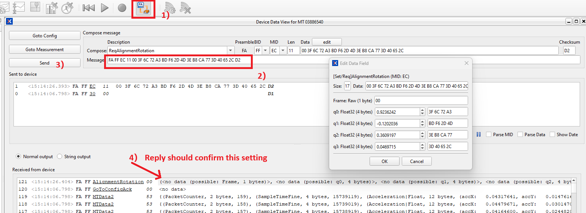

# Compute RotSensor for Tilted MTi

## Install

copy `xsensdeviceapi-2025.0.0-cp38-none-win_amd64.whl` from the `MT Software Suite 2025.0` folder(in my case: `F:\Program Files\Xsens\MT Software Suite 2025.0\MT SDK\Python\x64`), then

```bash
python -m venv venv
venv\Scripts\activate
pip install xsensdeviceapi-2025.0.0-cp38-none-win_amd64.whl
pip install scipy
```
## Run
```bash
python mti_receive_data_xda.py
```

## Change RotSensor In MT Manager

MT Manager - Device Data View

click "Goto Config"

copy paste the q_rotSensor HEX Xbus command, for example
```
FA FF EC 11 00 3F 6C 72 A3 BD F6 2D 4D 3E B8 CA 77 3D 40 65 2C D2
```
click send.

then click GoToMeasurement



## Orientation Correction Algorithm for Xsens IMU

### Overview

This document explains the orientation correction algorithm implemented in the provided code, which is designed to work with Xsens MTi devices. The algorithm establishes a reference frame by correcting the raw orientation data from the IMU sensor.

### Purpose

The primary purpose of this algorithm is to allow users to define a custom reference orientation. This is particularly useful when:

- The sensor cannot be physically mounted in the desired orientation
- A specific orientation needs to be defined as "zero" or "forward"
- Consistent alignment is required across multiple recording sessions

### Mathematical Foundation

#### Quaternion Representation

The algorithm uses quaternions to represent orientations. A quaternion is a four-dimensional complex number represented as:

$$q = w + xi + yj + zk$$

where $w$ is the scalar part, and $x$, $y$, $z$ form the vector part.

#### The Correction Formula

The core of the algorithm applies the following transformation:

$$q_{corrected} = q_{raw} \otimes q_{rotSensor}$$

Where:
- $q_{raw}$ is the quaternion representing the raw orientation from the sensor
- $q_{rotSensor}$ is the correction quaternion computed during initialization
- $\otimes$ represents quaternion multiplication

#### Post-Multiplication Significance

The correction quaternion $q_{rotSensor}$ appears on the right side of the multiplication because:

1. Quaternion multiplication is non-commutative: $q_1 \otimes q_2 \neq q_2 \otimes q_1$
2. Post-multiplication (applying $q_{rotSensor}$ on the right) applies the correction in the global reference frame
3. This ordering ensures that the correction is applied after the sensor's orientation is determined

In geometric terms, if we think of quaternions as representing rotations, then $q_{raw} \otimes q_{rotSensor}$ means "first rotate by $q_{raw}$, then rotate by $q_{rotSensor}$."

#### Computing the Correction Quaternion

The correction quaternion is elegantly derived as the conjugate of the initial orientation quaternion:

$$q_{rotSensor} = q_{initial}^* = w - xi - yj - zk$$

Since quaternions representing rotations are unit quaternions, the conjugate is equivalent to the inverse. This $q_{rotSensor}$ effectively "undoes" the initial orientation, making it the new zero reference.

## Requirements

- Xsens Device API (XDA) library
- An Xsens MTi device